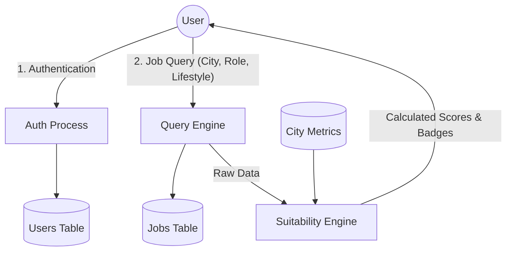
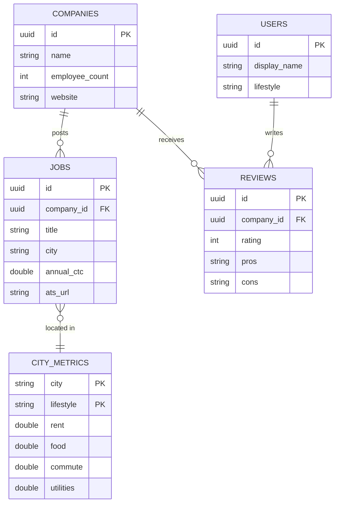

# Project Synopsis: Salariann — IT Job Market Platform

## 1. Project Title
**Salariann: IT Job Market Platform with Integrated Salary Suitability Scoring**

---

## 2. Introduction & Background
The Indian IT industry is one of the largest employers in the country, with millions of professionals working across major hubs such as Bangalore, Mumbai, Pune, Hyderabad, Chennai, and the National Capital Region (NCR). However, one of the most persistent challenges faced by job seekers is the high variation in the cost of living across these cities. A gross annual salary offer of ₹12 Lakhs per annum (LPA) provides a very different standard of living in Bangalore compared to Indore or Kochi.

Currently, candidates rely on fragmented tools during their job search:
- Standard job boards (e.g., Naukri, LinkedIn) to find listings.
- Company review portals (e.g., AmbitionBox, Glassdoor) to check culture and salary benchmarks.
- Cost-of-living index calculators (e.g., Numbeo) to estimate city expenses.

**Salariann** is a unified, data-driven platform designed to bridge this gap. By combining real-time job listings with hyper-local cost-of-living data, Salariann features a custom **Suitability Score Engine** that dynamically calculates disposable income and presents a traffic-light viability rating directly on the job listings page.

---

## 3. Problem Statement
Job seekers in the IT sector struggle with the following challenges:
1. **Financial Ambiguity**: The inability to quickly calculate net monthly disposable income from a gross CTC (Cost-to-Company) offer against local rent, food, transport, and utilities.
2. **Fragmented Workflows**: Shifting between job portals, review websites, and cost-of-living platforms.
3. **Lack of Lifestyle Customization**: Existing expense calculators do not allow candidates to specify lifestyle contexts (e.g., Single vs. Family) during the job discovery process.
4. **Information Asymmetry**: Lack of transparent, crowdsourced data on internal company interviews and compensation levels tailored to the Indian IT market.

---

## 4. Project Objectives
1. **Cross-Platform Interface**: To build a responsive, native-like frontend using **Flutter (Material 3)** targeting Web, Mobile, and Desktop platforms from a single codebase.
2. **Real-time Job Discovery**: To aggregate IT job listings and provide advanced filters (city, role type, salary range) combined with direct Applicant Tracking System (ATS) redirects.
3. **Suitability Score Integration**: To develop an engine that calculates net monthly income, subtracts city-specific expenses, and displays color-coded badges (`GREEN` for comfortable, `YELLOW` for manageable, `RED` for high stress).
4. **Crowdsourced Review System**: To enable secure, anonymous user contributions for company reviews, salary benchmarks, and interview experiences.
5. **Robust Backend Gateway**: To establish a secure Node.js (Express) backend integrated with PostgreSQL and Supabase for real-time authentication and data handling.

---

## 5. Proposed System & Architecture
Salariann is built as a decoupled three-tier system:
1. **Presentation Tier (Flutter)**: A reactive client application handling state management via Provider and declarative routing via GoRouter.
2. **Logic Tier (Node.js/Express)**: Serves as the API gateway, hosting the Suitability Score Engine and running authorization middleware.
3. **Data Tier (Supabase/PostgreSQL)**: Stores job listings, company reviews, user profiles, and city metrics. Relies on Docker for local deployment and containerization.

### High-Level System Architecture
```mermaid
graph TD
    subgraph Client Application (Flutter)
        UI[Material 3 UI Screens] <-->|Provider State| State[App State & Providers]
    end

    subgraph API Gateway (Node.js / Express)
        Router[Express Router] <-->|Auth Middleware| JWT[Supabase JWT Validator]
        Router <-->|Calculation Logic| Engine[Suitability Score Engine]
    end

    subgraph Data Store (Supabase & Docker)
        DB[(PostgreSQL Database)] <--> Auth[Supabase Auth]
        DB <--> Caching[TTL Cache Controller]
    end

    State <-->|REST / JSON| Router
    Engine <--> DB
    JWT <--> Auth
```

### Detailed Data Flow (Level 1 DFD)


---

## 6. Mathematical Model & Suitability Logic
The core value proposition of Salariann is its Suitability Score Engine. It performs the following sequential mathematical operations:

1. **Calculate Estimated Net Monthly Income**:
   $$ Net_{monthly} = \left( \frac{CTC_{annual}}{12} \right) \times 0.88 $$
   *Note: $0.88$ represents a baseline 12% deduction accounting for standard Income Tax and Employee Provident Fund (EPF) contributions.*

2. **Sum Localized City Expenses**:
   $$ Expenses_{total} = Rent + Food + Commute + Utilities $$
   *Where values are dynamically retrieved from the database based on the selected city and lifestyle parameter (Single vs. Family).*

3. **Calculate Savings Percentage**:
   $$ Savings_{pct} = \left( \frac{Net_{monthly} - Expenses_{total}}{Net_{monthly}} \right) \times 100 $$

4. **Assign Traffic-Light Badge**:
   - **GREEN (Comfortable)**: $Savings_{pct} \ge 30\%$
   - **YELLOW (Manageable)**: $10\% \le Savings_{pct} < 30\%$
   - **RED (High Financial Stress)**: $Savings_{pct} < 10\%$

---

## 7. Database Design & Schema
The relational database schema is structured as follows:



---

## 8. Technology Stack
- **Frontend App**: Flutter 3.0+ & Dart
  - *State Management*: Provider
  - *Navigation*: GoRouter
  - *UI System*: Material 3
- **Backend API**: Node.js & Express.js
- **Database Service**: Supabase (PostgreSQL)
- **Containerization**: Docker & Docker Compose
- **APIs & Scrapers**: Numbeo scraper (caching with 1-hour TTL), JSearch, Adzuna

---

## 9. Hardware & Software Requirements

### Hardware Requirements (Development)
- **Processor**: Intel Core i5 or Apple M1 (or higher)
- **RAM**: 8 GB minimum (16 GB recommended for running Docker and Flutter emulator concurrently)
- **Storage**: 50 GB available SSD space
- **Network**: Broadband internet connection for API communication

### Software Requirements
- **Operating System**: Windows 11 / macOS / Linux
- **Development Tools**: VS Code / Android Studio, Flutter SDK 3.0+, Node.js v16+, Docker Engine
- **Database Console**: Supabase Studio (Local Dashboard)

---

## 10. Implementation Phases
The project implementation is structured into four distinct milestones:

1. **Phase 1: Requirements Analysis & DB Design (Weeks 1–2)**
   - Database schema optimization and loading baseline city metrics from Numbeo for 20 Indian IT hubs.
   - Setting up Supabase Local containers via Docker.

2. **Phase 2: Backend API Development (Weeks 3–5)**
   - Developing endpoints for jobs, companies, reviews, and authentication.
   - Writing the Suitability Engine logic.

3. **Phase 3: Flutter Client Implementation (Weeks 6–9)**
   - Building Material 3 responsive layouts (Mobile/Web/Desktop).
   - Integrating Provider state controllers and connecting with backend REST endpoints.

4. **Phase 4: Testing & Deployment (Weeks 10–12)**
   - API load testing (evaluating latency metrics).
   - Verifying UI responsiveness and scoring algorithm accuracy across devices.

---

## 11. Expected Outcomes
1. **Reduced Decision Latency**: Job seekers can evaluate the economic viability of an offer in under a second rather than spending hours researching cost indices.
2. **Unified Navigation**: Eliminate context-switching by combining jobs, reviews, salaries, and affordability scoring in a single dashboard.
3. **Empowered Relocation**: Provide candidates with clear financial insights before they accept relocation offers to Tier-1 cities.
4. **Community Growth**: An active anonymous sharing platform for verified local salaries and interviews.
