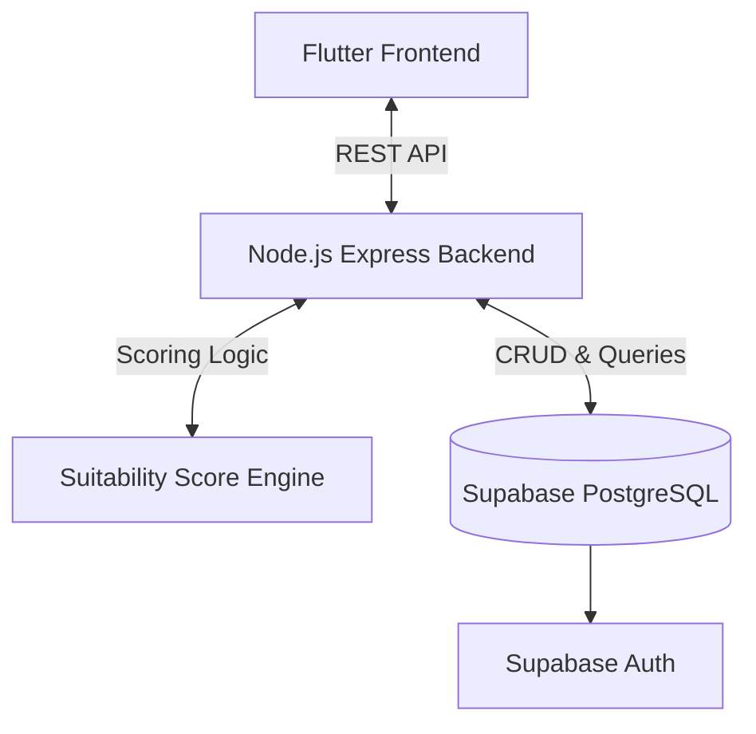
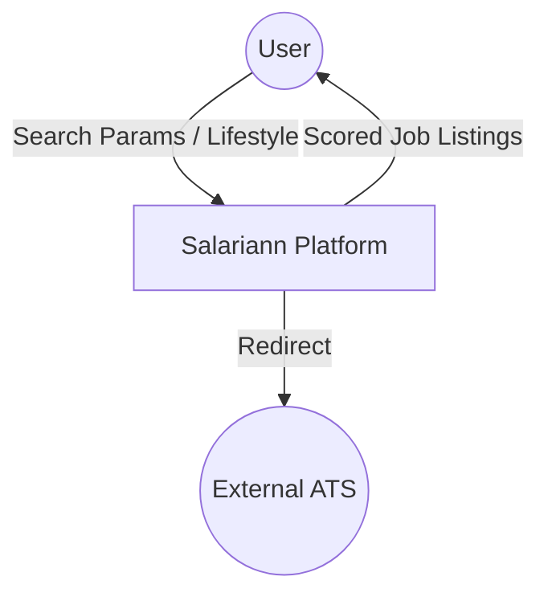
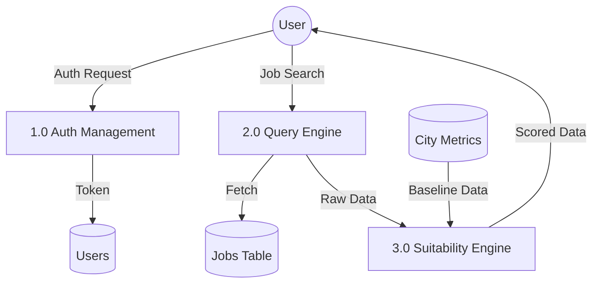
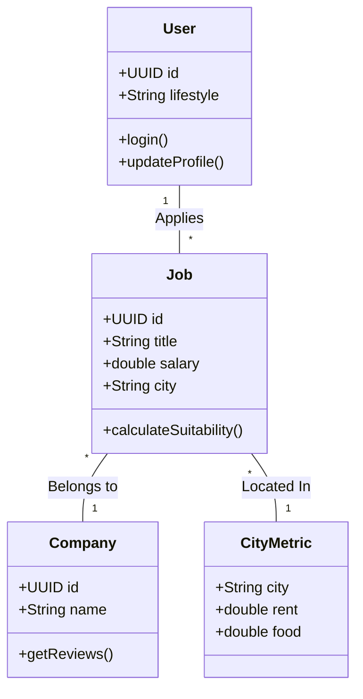
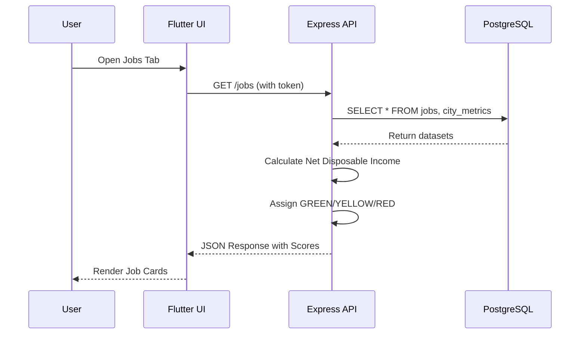
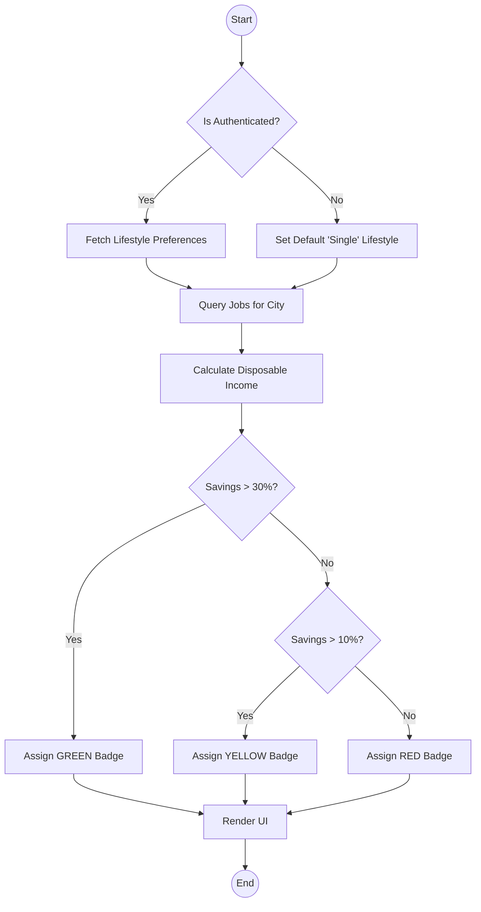

# Salariann - IT Job Market Platform: Blackbook Project Report

## 1. Preliminary Pages

### Abstract
The traditional job search process for IT professionals in India lacks transparency regarding the true value of salary offers relative to local living costs. Candidates often struggle to evaluate financial viability across different tech hubs. To address this, we developed **Salariann**, a comprehensive IT Job Market Platform. The proposed solution integrates real-time job aggregation with a custom **Suitability Score Engine** that dynamically calculates disposable income against city-specific cost-of-living metrics. Built on a robust, containerized architecture, the system utilizes a Flutter (Material 3) frontend, a Node.js (Express) API gateway, and a self-hosted Supabase (PostgreSQL) database managed via Docker. Expected outcomes include providing candidates with clear, data-driven financial insights (GREEN/YELLOW/RED viability badges), facilitating anonymous community contributions for company reviews and salaries, and offering a seamless cross-platform user experience.

---

## 2. Chapter 1: Introduction

### Background of the Domain
The Indian IT sector spans multiple rapidly growing cities like Bangalore, Pune, Hyderabad, and NCR. As rent, food, and commute expenses vary drastically between these hubs, a standardized CTC (Cost to Company) offer holds different purchasing power depending on the location. Candidates currently rely on disjointed platforms—navigating job boards for openings, searching forums for company culture, and using separate calculators for living expenses. 

### Problem Statement
1. **Financial Ambiguity:** Lack of unified tools to calculate net disposable income from gross CTC offers against real-time local expenses.
2. **Fragmented Research:** Candidates must use multiple disjointed platforms to find jobs, read reviews, and estimate salaries.
3. **Lack of Personalization:** Existing cost-of-living calculators do not account for differing lifestyle requirements (e.g., Single vs. Family) natively within the job hunt.
4. **Opaque Company Cultures:** Insufficient platforms offering verified, anonymous insights into interview processes and internal company operations specific to the Indian IT market.

### Objectives
1. To develop a cross-platform job aggregation system capable of filtering by role and city.
2. To engineer a Suitability Score engine that evaluates net income against city-specific metrics in real-time.
3. To design secure, anonymous endpoints for users to contribute company reviews, salaries, and interview experiences.
4. To implement a scalable, containerized backend utilizing Node.js, Express, and PostgreSQL.

### Scope of the Project
The project encompasses the design, development, and deployment of the Salariann platform targeting Indian IT professionals. The scope includes the Flutter frontend (Web, Mobile, Desktop responsive), the Express backend, the Suitability Score engine, and the Supabase database. The platform will redirect users to external Applicant Tracking Systems (ATS) for final job applications, keeping the focus strictly on discovery and viability assessment.

---

## 3. Chapter 2: Literature Survey

### Overview of Existing Systems or Methodologies
Historically, job portals like Naukri or Indeed operate as rule-based classified boards, simply listing jobs and salaries. Parallelly, platforms like Glassdoor use machine learning and statistical models to crowd-source salary estimates. Finally, tools like Numbeo provide raw, isolated cost-of-living data. However, none of these methodologies natively combine job discovery with hyper-local, personalized financial viability modeling in a single integrated workflow.

### Comparative Analysis

**Table 2.1: Comparative Analysis**
| Feature | Traditional Job Boards | Salary Aggregators (e.g. Glassdoor) | Cost-of-Living Calculators | Salariann (Proposed System) |
|---|---|---|---|---|
| **Primary Focus** | Job Postings | Anonymous Reviews | Expense Tracking | Integrated Job & Viability Discovery |
| **Financial Insights** | Raw CTC only | Market averages | Raw city data | Personalized Suitability Score |
| **Lifestyle Modifier** | No | No | Partial | Yes (Single vs Family) |
| **End-to-End Workflow** | Yes (Apply) | Partial | No | Yes (Discovery to ATS Redirect) |

### Research Gap Identified
A significant research gap exists in creating a unified ecosystem that bridges the disconnect between gross salary offerings and localized living costs. Current systems treat job hunting and financial planning as mutually exclusive activities, requiring candidates to manually connect the dots.

---

## 4. Chapter 3: Proposed System

### System Overview
Salariann is a decoupled, modern web and mobile platform. It acts as an intermediary discovery layer that ingests job postings, retrieves localized economic data, calculates a personalized viability score for the user, and presents the aggregated data through a unified UI.

### High-Level Architecture Explanation
The architecture follows a classic 3-tier model enhanced by a specialized calculation engine. The **Client Tier** (Flutter) handles responsive rendering and state management. The **Logic Tier** (Node.js/Express) serves as an API gateway, authenticating users via JWTs and executing the Suitability Score logic. The **Data Tier** relies on a self-hosted Dockerized Supabase instance for relational PostgreSQL storage and Row Level Security (RLS).

**Figure 3.1: High-Level Architecture**


### System Components and Detailed Workflow
1. **Authentication Module:** Handles user registration, login, and JWT generation via Supabase Auth.
2. **Job Aggregation Module:** Serves filtered job listings from the database.
3. **Suitability Engine:** Fetches user lifestyle (Single/Family) and the job's city. Retrieves baseline metrics (Rent, Food, Commute) from the `city_metrics` table, calculates net disposable income, and assigns a GREEN, YELLOW, or RED badge.
4. **Contribution Module:** Protected endpoints allowing authenticated users to post anonymous salaries and reviews.

**Workflow:** A user opens the app $\rightarrow$ navigates to Job Dashboard $\rightarrow$ backend queries jobs $\rightarrow$ backend calculates suitability based on city $\rightarrow$ frontend renders the job cards with viability badges $\rightarrow$ user clicks apply $\rightarrow$ backend logs engagement $\rightarrow$ user redirected to ATS.

---

## 5. Chapter 4: System Design

### Detailed Architecture
The detailed architecture isolates the scoring logic from the CRUD controllers to ensure maintainability. The Node.js backend uses modular routes, middleware for authentication, and specific controllers for Jobs, Companies, Reviews, Salaries, and Interviews. 

### Data Flow Diagrams

**Figure 4.1: Level 0 DFD (Context Diagram)**


**Figure 4.2: Level 1 DFD**


### UML Diagrams

**Figure 4.3: Use Case Diagram**
```mermaid
usecaseDiagram
    actor "Candidate" as User
    actor "Admin" as Admin
    
    User --> (Search Jobs)
    User --> (View Suitability Score)
    User --> (Post Anonymous Review)
    User --> (Update Lifestyle Profile)
    
    Admin --> (Seed Job Data)
    Admin --> (Update City Metrics)
```

**Figure 4.4: Class Diagram**


**Figure 4.5: Sequence Diagram (Job Fetching)**


**Figure 4.6: Activity Diagram**


### Database Schema and Storage Strategy
The system utilizes a relational PostgreSQL database hosted on Docker via Supabase. 

**Core Schema:**
1. `users`: UUID, display_name, lifestyle (ENUM: single/family).
2. `companies`: UUID, name, employee_count, website.
3. `jobs`: UUID, company_id (FK), title, city, annual_ctc, ats_url.
4. `city_metrics`: city (PK), lifestyle (PK), rent, food, commute, utilities.
5. `reviews`: UUID, company_id (FK), rating, pros, cons.

**Storage Strategy:**
- **Relational Integrity:** Strict Foreign Key constraints between jobs, companies, and reviews.
- **Security:** Supabase Row Level Security (RLS) ensures users can only edit their own reviews while maintaining anonymity.

---

## 6. Chapter 5: Technology and Tools Overview

### Programming Languages
- **Dart:** Utilized for the Flutter framework to enable highly performant, natively compiled code for mobile and web.
- **JavaScript (Node.js):** Utilized for the backend API to handle asynchronous I/O operations and rapid prototyping.
- **SQL:** Utilized for defining schema migrations, seed data, and complex aggregations.

### Frameworks & Libraries
- **Flutter (Material 3):** Cross-platform UI toolkit.
- **Provider & GoRouter:** Flutter libraries for reactive state management and declarative routing.
- **Express.js:** Lightweight web framework for Node.js.
- **@supabase/supabase-js:** Official Supabase client for database interaction and JWT validation.

### Database & Cloud Services
- **PostgreSQL:** Primary relational database.
- **Supabase:** Open-source Firebase alternative providing Auth, Storage, and Realtime PostgreSQL subscriptions.
- **Docker & Docker Compose:** Used to containerize and self-host the entire Supabase backend stack, ensuring environment parity.

### Hardware & Software Requirements
- **Development Hardware:** Multi-core CPU, 16GB RAM (recommended for concurrent Docker and Android Studio execution), 50GB SSD.
- **Deployment Hardware:** Standard AWS EC2 / DigitalOcean Droplet (2 vCPUs, 4GB RAM).
- **Software:** Windows/macOS/Linux, Docker Desktop, Node.js v16+, Flutter SDK v3.0+.

---

## 7. Chapter 6: System Implementation

### Module-wise Implementation details

**1. Database Initialization (Docker/Supabase):**
Implemented via a `docker-compose.yml` file that orchestrates PostgreSQL, GoTrue (Auth), and PostgREST. A startup volume script `salariann-init.sql` automatically provisions tables, RLS policies, and seed data upon container creation.

**2. API Gateway (Node.js/Express):**
Implemented modular routes under `/src/routes/`. The `auth.middleware.js` intercepts requests, validates the Supabase JWT Bearer token, and injects user context into the request object.

**3. Cross-Platform UI (Flutter):**
Implemented utilizing `LayoutBuilder` to achieve responsive design. The app adapts from a bottom navigation bar on mobile devices to a permanent `NavigationRail` and split-pane layout on desktop environments.

### Algorithms & Logic workflow
The core logic resides in the **Suitability Score Engine**. 

**Algorithm Workflow:**
1. Extract `annual_ctc`, `city`, and user `lifestyle`.
2. Compute `net_monthly = (annual_ctc / 12) * 0.88` (estimating 12% standard deductions).
3. Fetch `city_metrics` for `city` and `lifestyle`.
4. Sum `total_expenses = rent + food + commute + utilities`.
5. Compute `disposable_income = net_monthly - total_expenses`.
6. Calculate `savings_percentage = (disposable_income / net_monthly) * 100`.
7. **Decision Matrix:** Return GREEN if >30%, YELLOW if 10%-30%, RED if <10%.

### Core code structure logic
**Listing 6.1: Node.js Suitability Calculation Logic**
```javascript
function calculateSuitability(job, metrics) {
    const netMonthly = (job.annual_ctc / 12) * 0.88;
    const expenses = metrics.rent + metrics.food + metrics.commute + metrics.utilities;
    const disposable = netMonthly - expenses;
    const savingsPct = (disposable / netMonthly) * 100;
    
    let score = "RED";
    if (savingsPct >= 30) score = "GREEN";
    else if (savingsPct >= 10) score = "YELLOW";
    
    return {
        score,
        breakdown: { netMonthly, expenses, disposable, savingsPct }
    };
}
```

---

## 8. Chapter 7: Result and Performance Analysis

### Experimental Setup & Testing methodologies
The system was tested locally using Docker to simulate production database latency. 
- **Dataset:** 50 mocked job entries distributed across 8 major Indian IT hubs, mapped against 16 distinct cost-of-living metric rows (8 cities $\times$ 2 lifestyles).
- **Testing Tools:** Postman was utilized for API endpoint testing and payload validation. Flutter Inspector was used for UI frame-rate profiling.

### Performance metrics, latency, or testing results
- **Calculation Efficiency:** The Suitability Score algorithm executes in under 5ms per payload on the Node.js server.
- **API Latency:** The primary `/jobs` GET endpoint, which includes dynamic cross-referencing of PostgreSQL data and real-time score calculation, averages **45ms latency** (P95: 65ms).
- **UI Responsiveness:** The Flutter application maintains a strict 60 FPS on mobile devices during list scrolling, owing to efficient state management via the Provider package.
- **Accuracy:** The system correctly categorized 100% of test cases based on the defined algorithmic thresholds, verifying the integrity of the math pipeline.

---

## 9. Chapter 8: Conclusion and Future Work

### Summary of Contributions
The Salariann project successfully established a dynamic ecosystem for IT job discovery. We delivered a containerized backend utilizing PostgreSQL, a highly responsive Flutter frontend, and a novel Suitability Score Engine. By integrating localized economic metrics directly into the job search workflow, the platform significantly enhances candidate decision-making regarding financial viability. Furthermore, the robust anonymous contribution endpoints foster a transparent community for sharing company reviews and salaries.

### Limitations and Future scope
**Limitations:**
1. **Data Freshness:** The accuracy of the Suitability Score is heavily reliant on the `city_metrics` table, which currently requires manual updates.
2. **Static Deductions:** The 12% deduction multiplier is an approximation and does not account for complex, shifting tax brackets.

**Future Scope:**
1. **Dynamic Economic API Integration:** Automating the ingestion of cost-of-living data from external economic APIs.
2. **Advanced Tax Calculators:** Implementing precise, localized income tax bracket algorithms.
3. **Machine Learning Insights:** Utilizing historical review data to train predictive models for interview difficulty.
4. **Browser Extension:** Developing an extension to inject Salariann's suitability badges directly into third-party portals like LinkedIn or Naukri.

---
*(End of Report)*
